# EnjoyCamera

之前写过一系列的 GPUImage、OpenGL ES 相关的文章，但是写的例子都比较零散，也比较简单，并没有提供完整的项目。其实，在写博客的时候写了一个简单的相机应用，该项目以 GPUImage 为基础，涉及到了多种实时滤镜和图片处理，现在可以开源出来供大家学习。本项目使用的图片来自网络，因此不要用于商业用途。

# Idea

- Idea from: [GPUImage](https://github.com/BradLarson/GPUImage)
- Idea from [My JianShu Blog](https://www.jianshu.com/u/fff74d0ebed7)

# Feature

- 实现相机拍照、滤镜功能
- 实现图片的选择、裁剪和缩放
- 实现图片的滤镜
- 实现图片添加贴纸(贴纸可移动,放大,旋转,缩放,翻转)
- 实现了保存制作好的图片，并分享的功能
- 增加了崩溃日志收集功能

# Explanation

- 项目目前使用简单的MVC架构，但是里面包含了 ReactiveObjC 框架。之前准备用 MVVM 架构来实现的，但是想着项目本着简单的原则，让大家更容易学习 GPUImage、OpenGL ES 的相关内容，我在开源代码的时候去掉了 MVVM 的相关内容（毕竟学习 ReactiveObjC 的难度也不小嘛），但是一些简单的事件不用学习 ReactiveObjC ，理解起来难度并不大，因此也就没有去掉。总的来说，引入 ReactiveObjC 只是做简单的事件处理、实现简单的 KVO 功能（当然 ReactiveObjC 的功能远不止于此）。

# ScreenShot

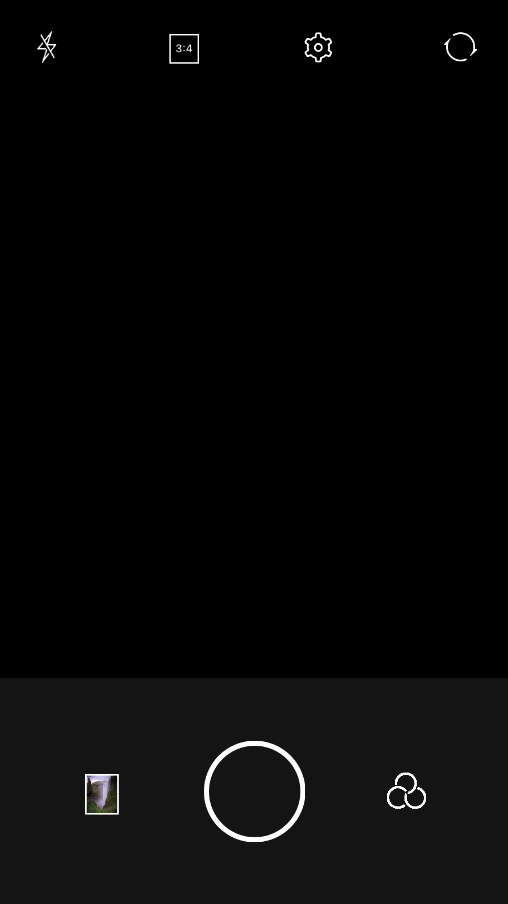
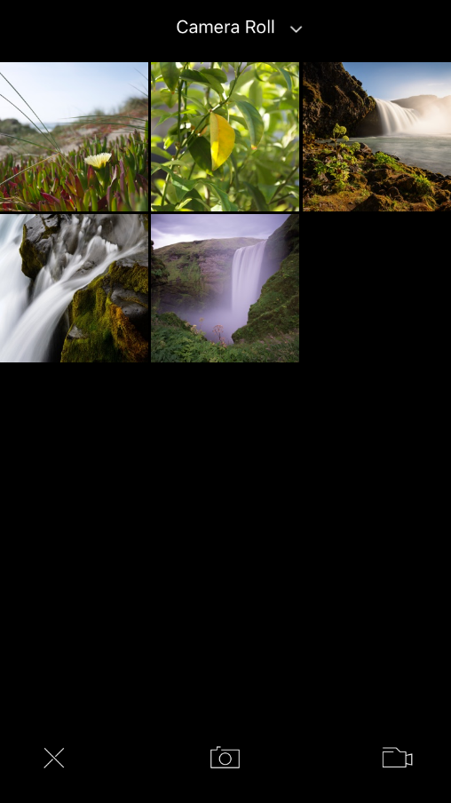
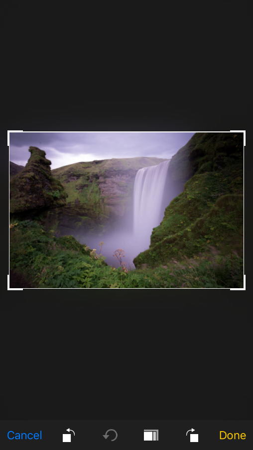
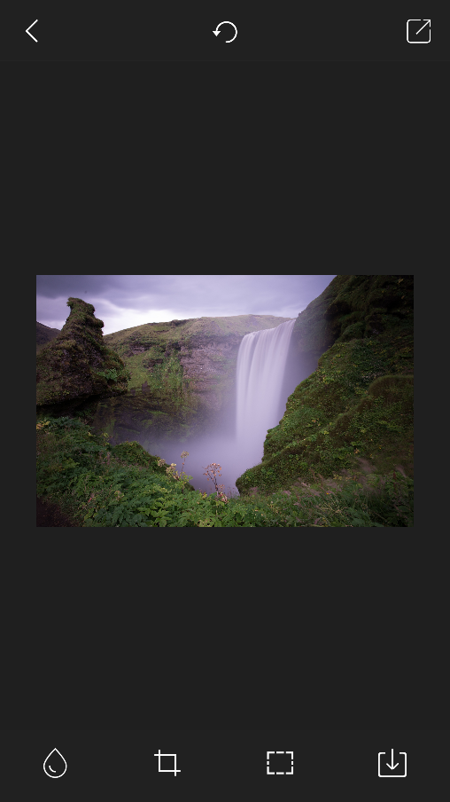
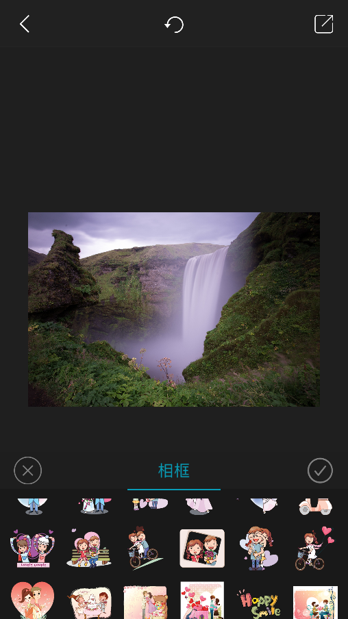
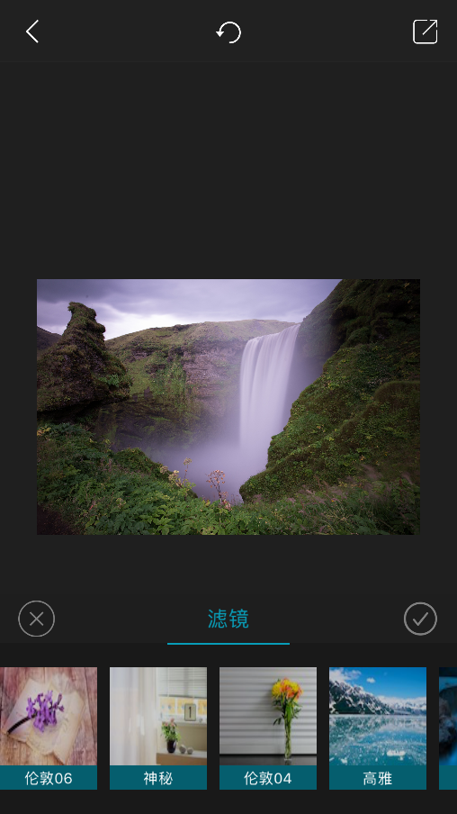
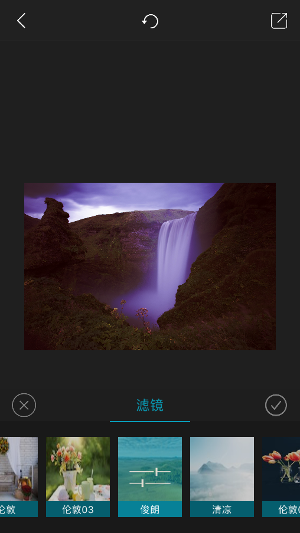

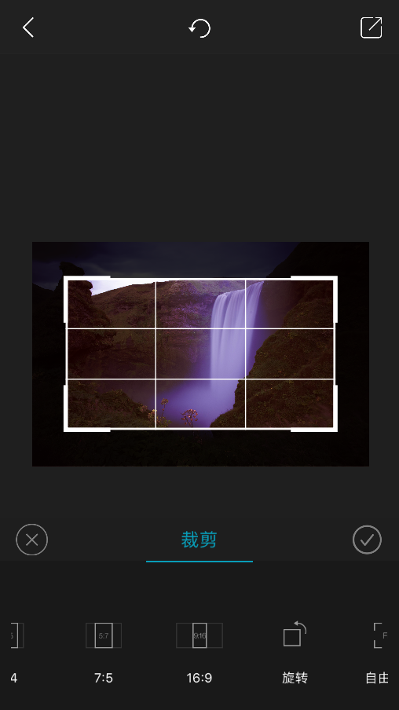
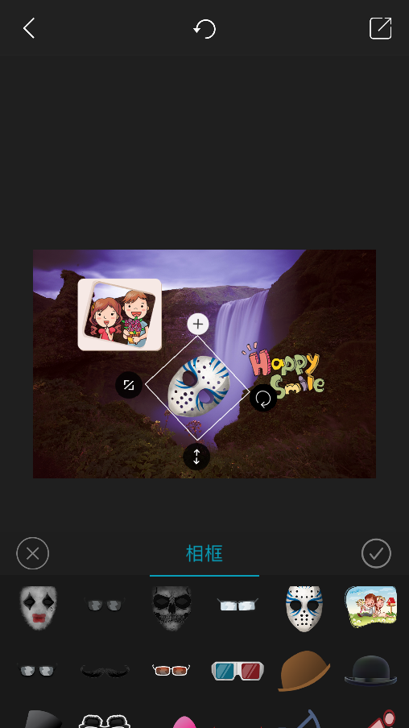
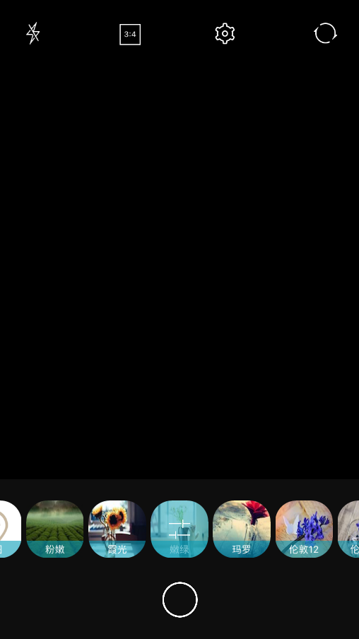
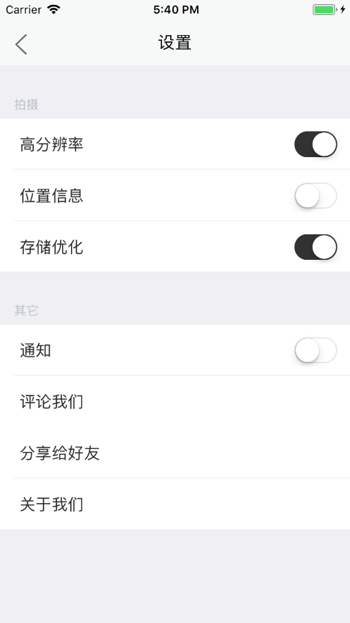
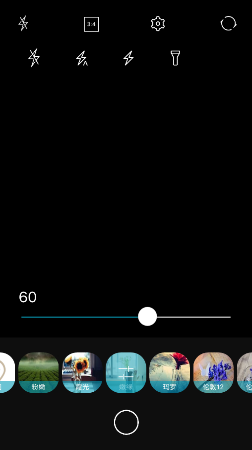

# Thanks

- [GPUImage](https://github.com/BradLarson/GPUImage)
- [SDWebImage](https://github.com/rs/SDWebImage)
- [YYModel](https://github.com/ibireme/YYModel)
- [AFNetworking](https://github.com/AFNetworking/AFNetworking)
- [Masonry](https://github.com/SnapKit/Masonry)
- ...


# Blog

- [秦明Qinmin](https://www.jianshu.com/u/fff74d0ebed7)


# Contact Me

- Email: 11gmqin@gmail.com

# License
```
Copyright 2017 Qinmin

Licensed under the Apache License, Version 2.0 (the "License");
you may not use this file except in compliance with the License.
You may obtain a copy of the License at

    http://www.apache.org/licenses/LICENSE-2.0

Unless required by applicable law or agreed to in writing, software
distributed under the License is distributed on an "AS IS" BASIS,
WITHOUT WARRANTIES OR CONDITIONS OF ANY KIND, either express or implied.
See the License for the specific language governing permissions and
limitations under the License.
```
